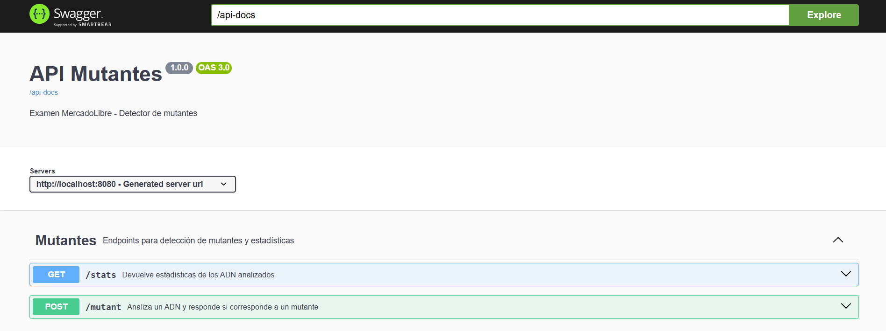
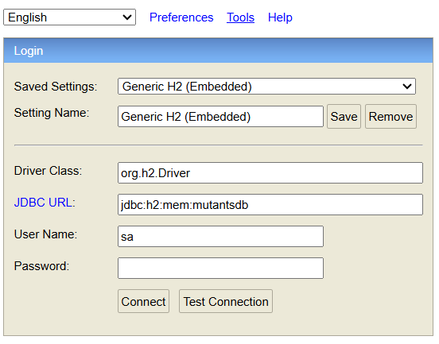
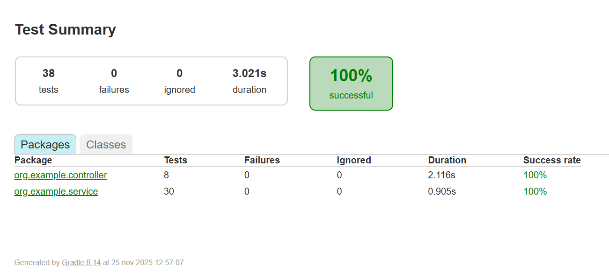
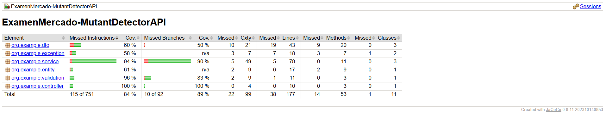

# 🧬 Mutant Detector API - Examen Mercado Libre

Proyecto hecho para la catedra de desarrollo de software de la facultad UTN
La idea es exponer un servicio REST que detecta si una secuencia de ADN corresponde a un mutante y además guarda las consultas en una base H2 en memoria.

### Alumno

- Nombre: Palermo Lourdes
- Legajo: 51020
- Comisión: 3k10
- Año: 2025

---

## Índice

- [Descripción general](#descripción-general)
- [Estructura del proyecto](#estructura-del-proyecto)
- [Cómo ejecutar la app](#cómo-ejecutar-la-app)
    - [Desde IntelliJ](#desde-intellij)
    - [Desde consola con Gradle](#desde-consola-con-gradle)
    - [Swagger](#swagger)
    - [H2 Console](#h2-console)
- [Endpoints](#endpoints)
- [Tests y cobertura](#tests-y-cobertura)
- [Diagramas de secuencia](#diagramas-de-secuencia)
- [Ejemplos de ADN](#ejemplos-de-adn)

---

## Descripción general

El objetivo del proyecto es exponer una API REST que reciba secuencias de ADN y determine si pertenecen a un mutante o a un humano, guardando el resultado en base de datos y exponiendo estadísticas.

### La app está armada con:

- Java 17 o mas
- Spring Boot 3
- H2 en memoria
- JPA
- Springdoc (Swagger)

### Nivel 1

- Implementación del método `isMutant(String[] dna)` en la clase `MutantDetector`.
- El algoritmo busca secuencias de **4 letras iguales seguidas** en:
    - Horizontal
    - Vertical
    - Diagonal principal
    - Diagonal inversa
- Si se encuentran **2 o más** secuencias, el ADN se considera mutante.
- Cuando ya se detectaron al menos 2 secuencias, el algoritmo corta y no sigue recorriendo toda la matriz.

### Nivel 2

- API REST con:
    - `POST /mutant` para analizar un ADN.
    - `GET /stats` para consultar estadísticas.
- Manejo de HTTP codes:
    - `200 OK` → ADN mutante.
    - `403 Forbidden` → ADN humano.
    - `400 Bad Request` → ADN inválido o request mal armado.
- Manejo de errores centralizado con un `@ControllerAdvice` que devuelve respuestas en JSON.

### Nivel 3

- Persistencia en base H2 en memoria.
- Entidad `DnaRecord` que guarda:
    - Hash del ADN (`dnaHash`)
    - Si es mutante o no (`isMutant`)
    - Fecha de creación (`createdAt`)
- Evito duplicar: si el hash ya existe, no vuelvo a guardar ni recalcular.
- `GET /stats` lee la base, cuenta mutantes y humanos y calcula el ratio.
- Documentación de la API con Swagger/OpenAPI.

---

## Estructura del proyecto

Paquetes principales (bajo `src/main/java/org/example`):

- `controller`
    - `MutantController`  
      Recibe el `POST /mutant`, valida el request y delega en `MutantService`.
    - `StatsController`  
      Expone `GET /stats` y devuelve un `StatsResponse`.

- `service`
    - `MutantDetector`  
      Algoritmo puro de detección (`isMutant`).
    - `MutantService`  
      Valida, calcula el hash, consulta/guarda en la base y usa `MutantDetector`.
    - `StatsService`  
      Pregunta al repositorio cuántos mutantes y humanos hay y arma la respuesta con el ratio.

- `dto`
    - `MutantRequest`  
      DTO de entrada para `POST /mutant` con el arreglo `dna`.
    - `StatsResponse`  
      DTO de salida para `GET /stats` (tiene `countMutantDna`, `countHumanDna` y `ratio`).

- `entity`
    - `DnaRecord`  
      Entidad JPA con el hash del ADN, el flag de mutante y la fecha de alta.

- `repository`
    - `DnaRecordRepository`  
      Extiende `JpaRepository<DnaRecord, Long>`.  
      Tiene métodos como:
        - `Optional<DnaRecord> findByDnaHash(String dnaHash)`
        - `long countByMutant(boolean mutant)`

- `validation`
    - `@ValidDnaSequence` (anotación)
    - `DnaSequenceValidator`  
      Valida que:
        - El ADN no sea nulo ni vacío.
        - Sea matriz **NxN** (todas las filas con la misma longitud, y filas = columnas).
        - Solo tenga caracteres `A`, `T`, `C`, `G`.

- `exception`
    - Excepciones de negocio específicas.
    - `GlobalExceptionHandler` para mapear las excepciones a códigos HTTP y mensajes claros en JSON.

- `config`
    - Configuración de Swagger/OpenAPI.
    - Config de H2 si hace falta.

- `MutantDetectorApplication`
    - Clase `@SpringBootApplication` con el método `main`.

---

## Cómo ejecutar la app

### Requisitos

- Java 17 instalado o versiones mayores.
- No hace falta instalar Gradle, se usa el wrapper (`gradlew` / `gradlew.bat`).

La raíz del proyecto es la carpeta donde está `build.gradle`.

---
### Desde IntelliJ

1. Abrir IntelliJ → `File > Open` → elegir la carpeta del proyecto.
2. Esperar que termine de bajar dependencias y sincronizar Gradle.
3. Ir a `src/main/java/org/example/MutantDetectorApplication.java`.
4. Ejecutar con el botón verde al lado de la clase (Run).
5. En la consola de IntelliJ, cuando aparezca:
    - `Tomcat started on port 8080`
    - `Started MutantDetectorApplication`
      significa que el servidor está levantado.

La API queda en:
- `http://localhost:8080`

Para detener, botón rojo de stop en la consola.

---

### Desde consola con Gradle

Parado en la raíz del proyecto:

```bash
# Windows
gradlew.bat clean test
gradlew.bat bootRun

# Linux / macOS
./gradlew clean test
./gradlew bootRun
```

La API queda en:
- `http://localhost:8080`

---
### Swagger
Con la App levantada 

1. Abrir el navegador en → http://localhost:8080/swagger-ui.html
2. Allí se puede probar 
   - POST /mutant 
   - GET /stats
3. Swagger muestra el esquema de cada endpoint y permite ejecutar la request desde el navegador.

4. 

---
### H2 Console
Con la App levantada
1. Ir a → http://localhost:8080/h2-console
2. Ingresar datos de conexión
   - URL: `jdbc:h2:mem:mutantsdb`
   - Usuario: `sa`
   - Password: vacío



## Endpoints

### 1) POST `/mutant`

- URL: http://localhost:8080/mutant
- Método: POST
- Content-Type: application/json

Recibe el ADN en formato JSON:

```json
{
  "dna": [
    "ATGCGA",
    "CAGTGC",
    "TTATGT",
    "AGAAGG",
    "CCCCTA",
    "TCACTG"
  ]
}

```

Respuestas posibles:

- `200 OK` → el ADN es mutante.
- `403 Forbidden` → el ADN es humano.
- `400 Bad Request` → ADN inválido (no NxN, caracteres inválidos, dna vacío, etc.).

El ADN que se analiza se guarda en la base (tabla `dna_records`) usando un hash SHA‑256 para evitar duplicados.

### 2) GET `/stats`

- URL: http://localhost:8080/stats
- Método: GET

Respuesta de ejemplo:

```json
{
  "count_mutant_dna": 40,
  "count_human_dna": 100,
  "ratio": 0.4
}
```
Campos:
- `count_mutant_dna` : cantidad de registros mutantes guardados.
- `count_human_dna`: cantidad de registros humanos.
- `ratio`: división entre mutantes y humanos (se maneja el caso sin humanos para no dividir por cero).
---
## Tests y cobertura

Los tests están en `src/test/java/org/example`.

### Tests por capa

- `controller`
    - `MutantControllerTest`  
      Usa `MockMvc` (con `@WebMvcTest`) para probar:
        - `POST /mutant` con ADN mutante → `200 OK`.
        - `POST /mutant` con ADN humano → `403 Forbidden`.
        - Casos de request inválido → `400 Bad Request` (caracteres inválidos, `dna` vacío, `dna` null, sin body).
        - `GET /stats` devolviendo valores simulados.

- `service`
    - `MutantDetectorTest`  
      Prueba directo el algoritmo:
        - Mutantes por horizontal, vertical, diagonal y diagonal inversa.
        - Casos humanos sin suficientes secuencias.
        - Matrices chicas donde no da el tamaño.
        - Matrices no cuadradas, caracteres inválidos, `null`, arreglo vacío, etc.  
          En total hay **17+ tests** cubriendo varias combinaciones.
    - `MutantServiceTest`  
      Usa Mockito para mockear `DnaRecordRepository`:
        - Si el hash ya existe, reutiliza el resultado y no vuelve a llamar al detector ni a guardar.
        - Guarda nuevos mutantes y humanos con el hash y la fecha.
        - Verifica que el hash se genere siempre igual para el mismo ADN.
    - `StatsServiceTest`  
      Calcula las estadísticas a partir de valores mockeados:
        - Con humanos y mutantes.
        - Sin humanos.
        - Sin datos.
        - Casos con ratio decimal, valores grandes y casos límite.

### Cómo correr los tests

Desde consola, parado en la raíz del proyecto:

```bash
# Windows
gradlew.bat test

# Linux / macOS
./gradlew test
```

Desde IntelliJ:
- Click derecho sobre el paquete org.example dentro de src/test/java → Run 'Tests in org.example'. 
- O correr cada clase con el triángulo verde al lado del nombre

El reporte queda en → `build/reports/tests/test/index.html`



### Cobertura (JaCoCo)
Para generar el reporte de cobertura:

```bash
# Windows
gradlew.bat test jacocoTestReport

# Linux / macOS
./gradlew test jacocoTestReport
```
El reporte queda en → `build/reports/jacoco/test/html/index.html`



---
### Diagramas de secuencia

[VOLVER ACA QUE MISERIA DIOS AYUDA]

---
### Ejemplos de ADN
Estos son algunos ejemplos que use para probar el funcionamiento 

#### ADN humano (no mutante)
```json
{
  "dna": [
    "ATGCGA",
    "CAGTGC",
    "TTATGT",
    "AGACGG",
    "GCGTCA",
    "TCACTG"
  ]
}

```

#### ADN mutante (horizontal fuerte)
```json
{
  "dna": [
    "AAAAAA",
    "CAGTGC",
    "TTATGT",
    "AGAAGG",
    "CCCCTA",
    "TCACTG"
  ]
}

```

#### ADN mutante (vertical)
```json
{
  "dna": [
    "ATGCGA",
    "AAGTGC",
    "ATATGT",
    "AGAAGG",
    "ACCCCT",
    "ATCACT"
  ]
}

```
#### ADN mutante combinado (el del enunciado)
```json
{
  "dna": [
    "ATGCGA",
    "CAGTGC",
    "TTATGT",
    "AGAAGG",
    "CCCCTA",
    "TCACTG"
  ]
}

```